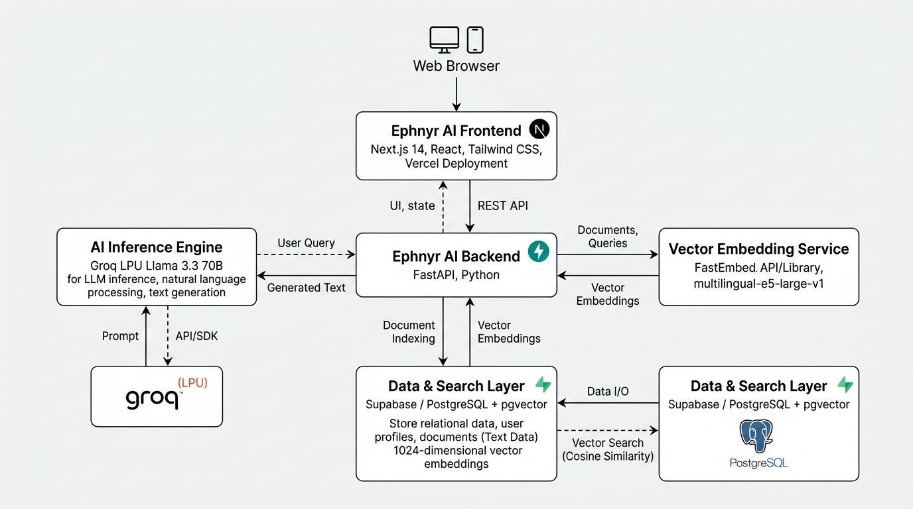

# Ephnyr AI

Ephnyr AI is a full-stack, multi-tenant Retrieval-Augmented Generation (RAG) platform designed for document similarity grounding and AI chatbot interactions. The platform allows users to create isolated Knowledge Pods (rooms), upload multi-format documents (PDF, DOCX, TXT, MD), index vector chunks into PostgreSQL via `pgvector`, and query an interactive AI chatbot backed by Groq LPU Llama 3.3 70B inference.

---

## Architecture Overview



The application follows a decoupled client-server architecture:
- **Frontend Layer**: Next.js 14 App Router with Server Actions handling authentication, state management, modal dialogs, and workspace routing.
- **Backend API Layer**: FastAPI web server providing asynchronous document ingestion, text extraction, LangChain chunking, and similarity search endpoints.
- **Data & Vector Store**: Supabase PostgreSQL database storing relational models (`users`, `rooms`, `documents`) alongside a 384-dimensional HNSW vector index (`document_chunks`) powered by `pgvector`.
- **Embedding & LLM Engine**: Local CPU FastEmbed model (`BAAI/bge-small-en-v1.5`) for vector generation and Groq LPU (`llama-3.3-70b-versatile`) for sub-500ms grounded text completion.

---

## Technology Stack

### Frontend
- **Framework**: Next.js 14 (App Router, Server Actions)
- **Language**: TypeScript
- **Styling**: Vanilla CSS, TailwindCSS, Radix UI Primitives, Lucide Icons
- **Authentication**: Supabase SSR Auth Cookies

### Backend
- **Framework**: FastAPI (Python 3.11+)
- **Package Manager**: Astral `uv`
- **RAG Pipeline**: LangChain (`langchain-core`, `langchain-text-splitters`)
- **Embeddings**: FastEmbed (`BAAI/bge-small-en-v1.5`, 384 dimensions)
- **Parsers**: `pypdf`, `python-docx`, `pdfplumber`, `markdown`
- **LLM Provider**: Groq API (`llama-3.3-70b-versatile`)
- **HTTP Client**: `httpx`

### Database & Storage
- **Database**: Supabase PostgreSQL
- **Vector Search**: PostgreSQL `pgvector` extension with HNSW index
- **Object Storage**: Supabase Storage bucket (`room-documents`)
- **Security**: Row Level Security (RLS) policies

### Infrastructure
- **Containerization**: Docker, Docker Compose

---

## System Data Workflows

### 1. Document Ingestion Pipeline
1. **Upload**: The user uploads a file (PDF, DOCX, TXT, MD) via the Room Workspace.
2. **Validation**: The system verifies the single file size limit (<= 5MB) and room storage quota (<= 10MB).
3. **Storage**: The raw file is stored in Supabase Storage (`room-documents`).
4. **Extraction**: `services/text_extractor.py` parses file bytes into native LangChain `Document` objects.
5. **Chunking**: `services/chunker.py` applies `RecursiveCharacterTextSplitter` (1,000 characters per chunk, 150-character overlap).
6. **Vector Generation**: `services/embedding_service.py` generates 384-dimensional dense vector embeddings using local CPU `FastEmbed`.
7. **Database Insert**: Vector chunks and metadata are inserted into `public.document_chunks`.
8. **Status Update**: Document status transitions from `PROCESSING` to `READY` with total chunk metrics.

### 2. RAG Query & Inference Pipeline
1. **User Query**: The user sends a question via the chatbot interface (`/share/[slug]`).
2. **Privacy Enforcement**: The backend verifies if the Knowledge Pod is public or private. Private pods restrict access to the authenticated owner.
3. **Query Embedding**: The query text is converted into a 384-dimensional vector embedding.
4. **Similarity Lookup**: Supabase RPC function `match_document_chunks` executes cosine distance matching against the target `room_id`.
5. **Context Assembly**: Top document chunks are retrieved and formatted with grounding directives.
6. **LLM Inference**: The prompt payload is sent to Groq LPU (`llama-3.3-70b-versatile`).
7. **Response & Citations**: The answer is returned along with source document citations and match percentages.

### 3. Ephemeral Messaging & Privacy Model
- **Public Pods (`is_public = true`)**: Accessible to any visitor with the public share link.
- **Private Pods (`is_public = false`)**: Restricted to the pod owner via JWT token validation.
- **Zero-Trace Storage**: Chat conversation history is stored strictly in browser `sessionStorage` and React state. Closing the tab or browser automatically clears all message history.

---

## Repository Structure

```text
ephnyr/
├── backend/
│   ├── api/
│   │   ├── v1/
│   │   │   ├── chat.py           # Chatbot query & room access endpoints
│   │   │   ├── documents.py      # Document registration & management endpoints
│   │   │   ├── health.py         # Health check endpoint
│   │   │   ├── rooms.py          # Knowledge Pod CRUD endpoints
│   │   │   └── router.py         # API router aggregator
│   │   └── deps.py               # Dependency injection helpers
│   ├── core/
│   │   ├── config.py             # Application settings & environment variables
│   │   ├── database.py           # Supabase client singleton initialization
│   │   ├── exceptions.py         # Custom HTTP exception handlers
│   │   └── security.py           # JWT token authentication & optional auth guards
│   ├── schemas/                  # Pydantic data schemas
│   ├── services/
│   │   ├── chat_service.py       # Vector similarity search & Groq LLM inference
│   │   ├── chunker.py            # LangChain text chunking engine
│   │   ├── document_service.py   # Document ingestion orchestrator
│   │   ├── embedding_service.py  # FastEmbed vector embedding wrapper
│   │   ├── room_service.py       # Knowledge Pod business logic & quota guards
│   │   └── text_extractor.py     # Multi-format document parser
│   ├── Dockerfile
│   ├── main.py                   # FastAPI entrypoint
│   ├── pyproject.toml            # Dependencies managed by Astral uv
│   └── requirements.txt
├── frontend/
│   ├── actions/                  # Next.js Server Actions (auth, rooms, documents, chat)
│   ├── app/                      # Next.js App Router pages
│   │   ├── dashboard/            # Dashboard & Knowledge Pod workspaces
│   │   ├── share/[slug]/         # Public / Private RAG Chatbot interface
│   │   ├── layout.tsx
│   │   └── page.tsx              # Landing page
│   ├── components/               # UI components & modals
│   ├── utils/                    # Supabase browser/server client helpers
│   ├── Dockerfile
│   └── package.json
├── docker-compose.yml            # Multi-container orchestration
├── supabase_schema.sql           # Database schema, pgvector setup & RPC functions
└── README.md
```

---

## Installation & Setup

### Prerequisites
- Node.js 20+ and npm
- Python 3.11+
- Astral `uv` (recommended) or `pip`
- Supabase account with PostgreSQL database
- Groq API Key

---

### Step 1: Database Setup

1. Log in to your [Supabase Dashboard](https://supabase.com).
2. Open the **SQL Editor** for your project.
3. Paste the contents of `supabase_schema.sql` and execute the query. This will:
   - Enable `uuid-ossp` and `vector` extensions.
   - Create `users`, `rooms`, `documents`, `document_chunks`, `chat_sessions`, and `messages` tables.
   - Create HNSW cosine similarity index on `document_chunks.embedding`.
   - Create the `match_document_chunks` RPC function.
   - Enable Row Level Security (RLS) and configure the `room-documents` storage bucket policies.

---

### Step 2: Environment Variables

#### Frontend Environment (`frontend/.env`)
Create `frontend/.env`:
```env
NEXT_PUBLIC_SUPABASE_URL=https://your-supabase-project.supabase.co
NEXT_PUBLIC_SUPABASE_ANON_KEY=your-supabase-anon-key
SUPABASE_SERVICE_ROLE_KEY=your-supabase-service-role-key
NEXT_PUBLIC_BACKEND_URL=http://localhost:8000/api/v1
```

#### Backend Environment (`backend/.env`)
Create `backend/.env`:
```env
SUPABASE_URL=https://your-supabase-project.supabase.co
SUPABASE_ANON_KEY=your-supabase-anon-key
SUPABASE_SERVICE_ROLE_KEY=your-supabase-service-role-key
GROQ_API_KEY=your-groq-api-key
FRONTEND_URL=http://localhost:3000
```

---

### Step 3: Run Nationally (Native Development)

#### Backend Setup
```bash
cd backend

# Install dependencies using uv
uv sync

# Run development server
uv run uvicorn main:app --reload --port 8000
```

#### Frontend Setup
```bash
cd frontend

# Install dependencies
npm install

# Run development server
npm run dev
```

Open `http://localhost:3000` in your web browser.

---

### Step 4: Run with Docker Compose

You can build and start both the frontend and backend containers using Docker Compose:

```bash
docker-compose up --build
```

- **Frontend Application**: `http://localhost:3000`
- **FastAPI API Base**: `http://localhost:8000/api/v1`
- **FastAPI OpenAPI Documentation**: `http://localhost:8000/docs`

---

## Free Tier Quotas & Constraints

- **Max Knowledge Pods per user**: 3
- **Max File Size**: 5 MB per file
- **Max Room Storage Capacity**: 10 MB per Knowledge Pod
- **Embedding Dimensions**: 384 (FastEmbed `BAAI/bge-small-en-v1.5`)
- **LLM Inference**: Groq LPU `llama-3.3-70b-versatile`

---

## License

This project is open source and available under the MIT License.
